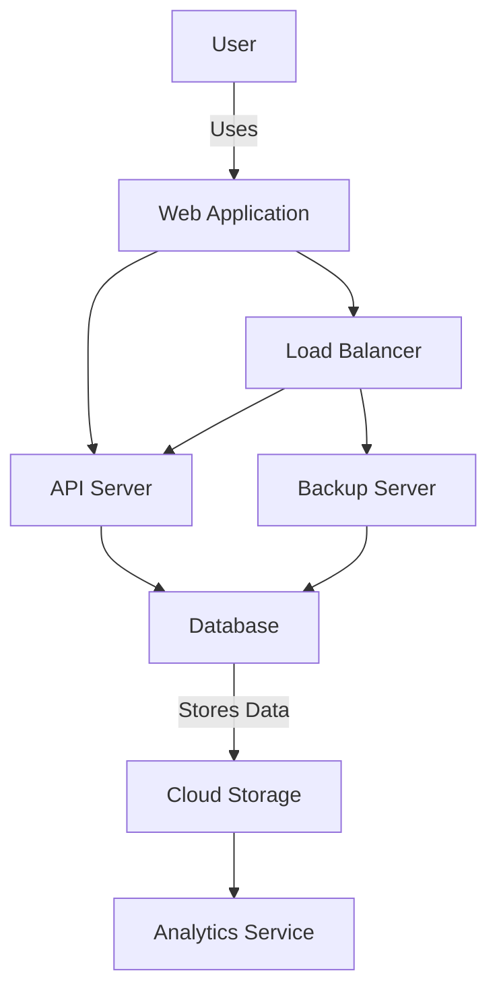

# Cloud Architecture Overview

```mermaid
graph TD;
    A[User] -->|Uses| B[Web Application];
    B --> C[API Server];
    C --> D[Database];
    D -->|Stores Data| E[Cloud Storage];
    B --> F[Load Balancer];
    F --> C;
    F --> G[Backup Server];
    E --> H[Analytics Service];
    G --> D;
```