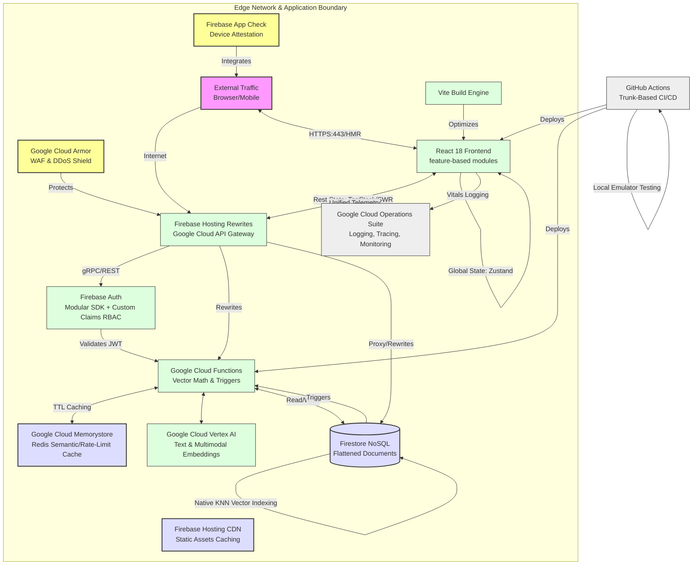

# Cloud Architecture Overview

```mermaid
graph TD
    classDef external fill:#f9f,stroke:#333,stroke-width:2px
    classDef security fill:#ff9,stroke:#333,stroke-width:2px
    classDef compute fill:#dfd,stroke:#333,stroke-width:1px
    classDef data fill:#ddf,stroke:#333,stroke-width:2px
    classDef ops fill:#eee,stroke:#333,stroke-width:1px

    Client["External Traffic<br/>Browser/Mobile"]:::external -->|Internet| EdgeTunnel:::security

    subgraph EdgeBoundary["Edge Network & Application Boundary"]
        EdgeTunnel["Firebase Hosting Rewrites<br/>Google Cloud API Gateway"]:::compute
        Armor["Google Cloud Armor<br/>WAF & DDoS Shield"]:::security
        AppCheck["Firebase App Check<br/>Device Attestation"]:::security
        Armor -->|Protects| EdgeTunnel
        AppCheck -->|Integrates| Client

        FE["React 18 Frontend<br/>feature-based modules"]:::compute
        Vite["Vite Build Engine"]:::compute
        Vite -->|Optimizes| FE

        Auth["Firebase Auth<br/>Modular SDK + Custom Claims RBAC"]:::compute
        Functions["Google Cloud Functions<br/>Vector Math & Triggers"]:::compute
        Vertex["Google Cloud Vertex AI<br/>Text & Multimodal Embeddings"]:::compute

        CDN["Firebase Hosting CDN<br/>Static Assets Caching"]:::data
        Memory["Google Cloud Memorystore<br/>Redis Semantic/Rate-Limit Cache"]:::data
        FS[("Firestore NoSQL<br/>Flattened Documents")]:::data

        GCOps["Google Cloud Operations Suite<br/>Logging, Tracing, Monitoring"]:::ops
    end

    Client <-->|HTTPS:443/HMR| FE
    FE <-->|Rest State: TanStack/SWR| EdgeTunnel
    FE -->|Global State: Zustand| FE
    EdgeTunnel -->|gRPC/REST| Auth
    EdgeTunnel -->|Rewrites| Functions
    EdgeTunnel -->|Proxy/Rewrites| FS

    Auth -->|Validates JWT| Functions
    Functions <-->|TTL Caching| Memory
    Functions <--> Vertex
    Functions <-->|Read/Write| FS
    FS -->|Triggers| Functions
    FS -->|Native KNN Vector Indexing| FS

    GCOps -->|Unified Telemetry| EdgeBoundary
    FE -->|Vitals Logging| GCOps
    
    GitHubActions["GitHub Actions<br/>Trunk-Based CI/CD"]:::ops
    GitHubActions -->|Deploys| FE
    GitHubActions -->|Deploys| Functions
    GitHubActions -->|Local Emulator Testing| GitHubActions
```